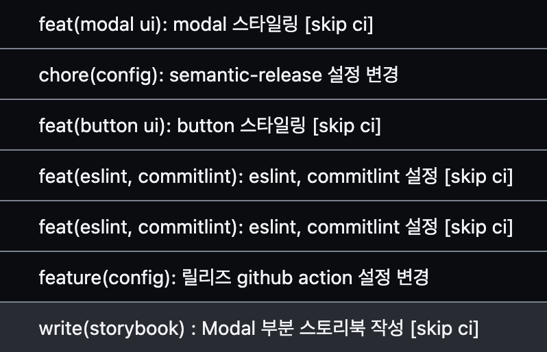

commitlint로 코드 컨벤션 설정하기



<!--truncate-->

## Commitlint란

코드 수정 후 기록을 commit할 때 작성될 message 방식을 설정할 수 있습니다.

- `feature: commitlint setting`
- `feature(commitlint): setting`
- `✨ feature(commitlint): setting`

## commitlint 시작하기

### 패키지 설치

```
yarn add -D @commitlint/cli @commitlint/config-conventional
```

### commitlint 설정

먼저 다음과 같이 설치된 @commitlint/config-conventional을 상속받아 준 후 rules를 통해 제한을 둡니다.

```js title="commmitlint.config.js"
module.exports = {
  extends: ["@commitlint/config-conventional"],
  rules: {},
};
```

커밋규칙은 `type(scope): subject`입니다.

1. scope는 `camel-case`로 작성하며 무조건 적어야한다.
2. type은 `["feat", "fix", "chore", "refactor", "write"]`
3. subject는 무조건 작성되어야한다.

```js title="commitlint.config.js"
module.exports = {
  extends: ["@commitlint/config-conventional"],
  rules: {
    "header-max-length": [2, "always", 72],
    "body-leading-blank": [2, "always"],
    "body-max-length": [2, "always", 400],
    "footer-leading-blank": [2, "always"],
    "scope-case": [2, "always", ["camel-case"]],
    "scope-empty": [2, "never"],
    "subject-empty": [2, "never"],
    "subject-case": [2, "always", ["lower-case"]],
    "type-enum": [2, "always", ["feat", "fix", "chore", "refactor", "write"]],
  },
};
```

### gitmoji 설정

커밋 방식에서 이모지를 사용하고 싶을 때 설정하는 방법이다.

```js title="commmitlint.config.js"
import gitmojiParserOpts from "@gitmoji/parser-opts";
import gitmojiPlugin from "commitlint-plugin-gitmoji";

const parserPreset: LintOptions = {
  parserOpts: gitmojiParserOpts,
  plugins: {
    gitmoji: gitmojiPlugin,
  },
};

module.exports = {
  extends: ["@commitlint/config-conventional"],
  rules: {},
  parserPreset,
  plugins: [gitmojiPlugin],
};
```
