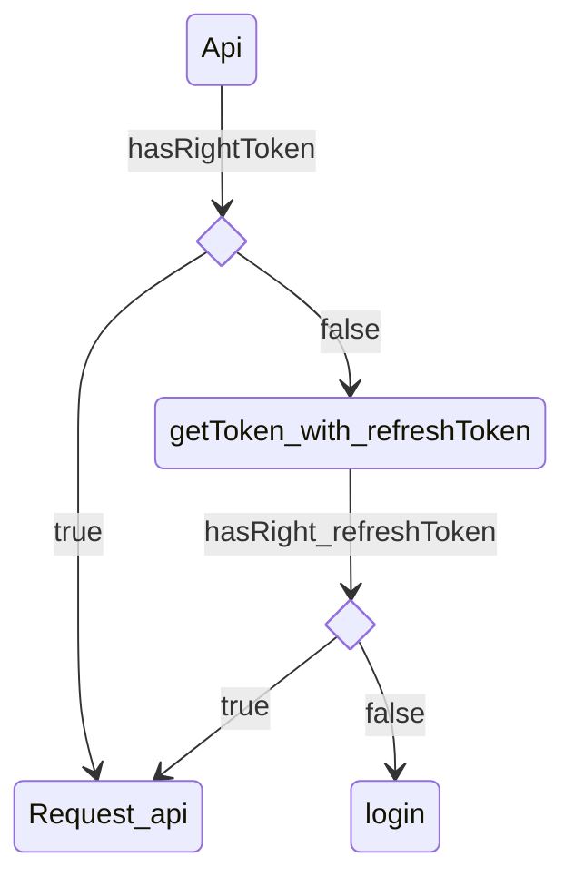

# 토큰 다이어그램

api를 통신하는 과정에서 일어나는 토큰 다이어그램입니다.

```mermaid
stateDiagram-v2
    state if_state <<choice>>
    state if_state2 <<choice>>

    Api --> if_state: hasRightToken
    if_state --> getToken_with_refreshToken : false
    if_state --> Request_api: true
    getToken_with_refreshToken --> if_state2: hasRight_refreshToken
    if_state2 --> Request_api : true
    if_state2 --> login : false
```
