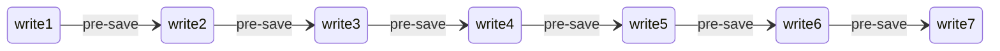
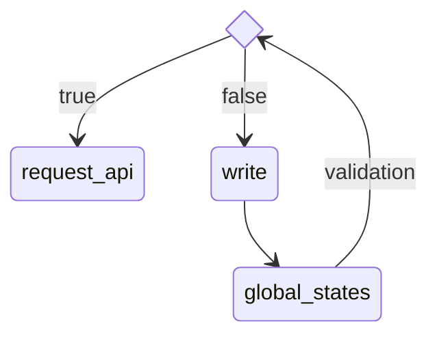

# 원서접수 state 다이어그램

```mermaid
stateDiagram-v2
    direction LR
    write1 --> write2: pre-save
    write2 --> write3: pre-save
    write3 --> write4: pre-save
    write4 --> write5: pre-save
    write5 --> write6: pre-save
    write6 --> write7: pre-save
```

```mermaid
stateDiagram-v2
    state if_state <<choice>>
    global_states --> if_state: validation
    if_state --> request_api: true
    if_state --> write: false
    write --> global_states
```
