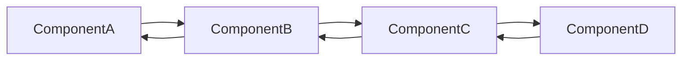

# OrderFunnel

### index를 통한 컴포넌트 교체



## 사용 용도

Index에 따른 컴포넌트 교체 방식을 도입할 때 사용됩니다.

## 사용 방법

OrderFunnel에 children 값을 통해 순서를 지정하고 page 값을 이용하여 그에 맞는 순서의 컴포넌트만 렌더링하게됩니다.

```jsx title="OrderFunnelPage.tsx"
import React from "react";
import { OrderFunnel } from "@dgswcns/cns-funnel";

export default function OrderFunnelPage() {
  return (
    <OrderFunnel page={Number}>
      <h1>Component1</h1>
      <h1>Component2</h1>
    </OrderFunnel>
  );
}
```
