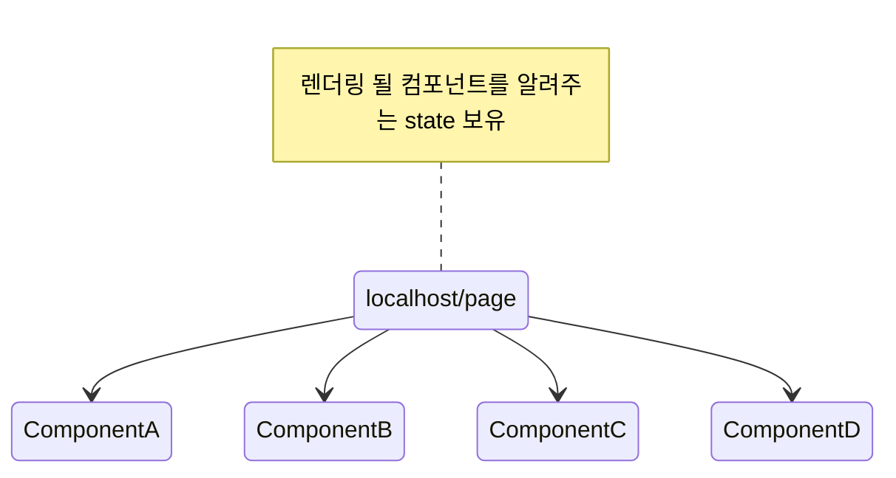

# useKeyFunnel

### 한 페이지에서 state에 따른 컴포넌트 교체



## 사용 용도

string에 따른 컴포넌트 교체 방식을 도입할 때 사용됩니다.

## 사용 방법

- return 값인 배열에서 첫번 째 인자를 통해 Group을 묶습니다.
- 그후 2번 째 인자로 name이란 props를 활용하여 렌더링될 조건을 설정합니다.
- 컴포넌트를 바꾸기 위해선 3번 째 인자인 함수를 통해 바꿉니다.

```jsx title="useKeyFunnelPage.tsx"
import React from "react";
import { useKeyFunnel } from "@dgswcns/cns-funnel";

export default function OrderFunnelPage() {
  const [ABFunnel, Step, setStep] = useKeyFunnel<"A"|"B">();
  return (
    <ABFunnel>
      <Step name="A">Component1</Step>
      <Step name="B">Component2</Step>
    </ABFunnel>
  );
}
```
